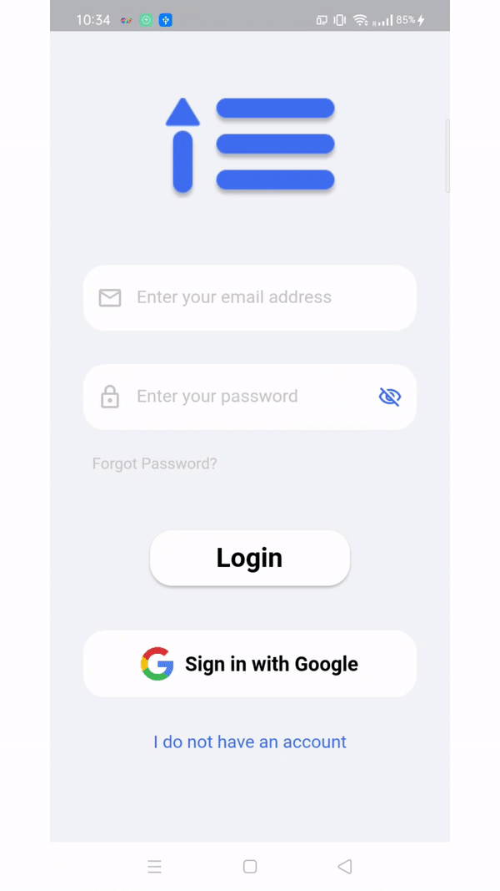
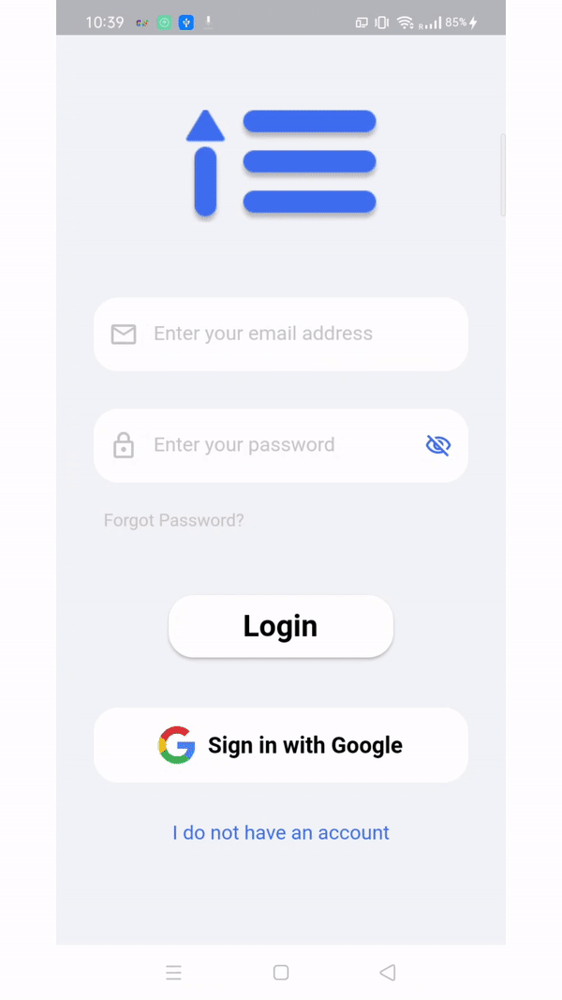
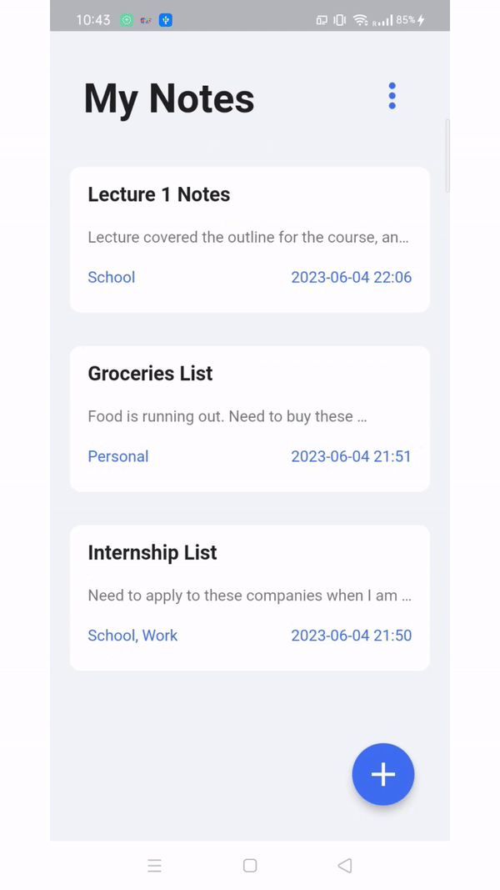
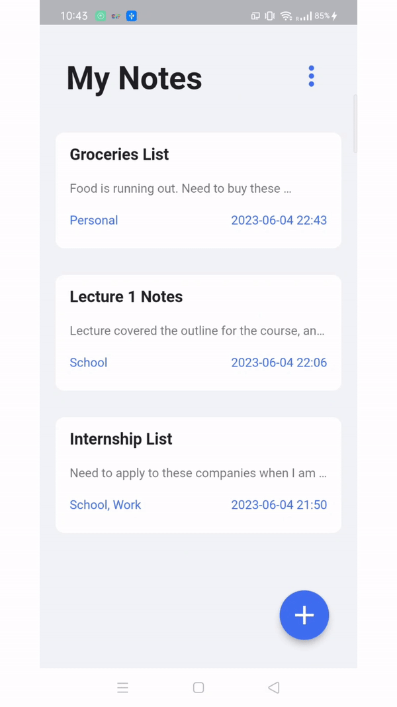
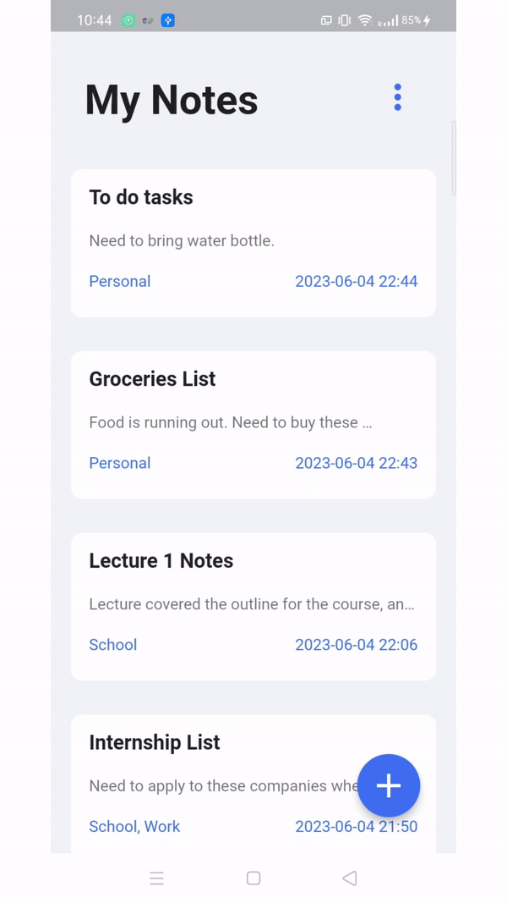

# neatnotes

neatnotes is a notes-taking Android mobile application that aims to allow users to easily create and manage their notes on the go. It has a simplistic yet functional interface, making it easy
for anyone to use.

For the front-end, it is built using Flutter. For the backend, neatnotes utilises Firebase authentication to ensure that users would not be able to see each other's notes, as well as Firestore to store notes data.

This is an application that I built when I first picked up Flutter, and it is adapted from the tutorial provided by [Vandad Nahavandipoor](https://www.youtube.com/watch?v=VPvVD8t02U8). If you are interested in learning Flutter, I would highly recommend Vandad's course, which not only provides a good introduction of Dart and Flutter, but also the intricacies of software development.

## APK Download
You can run the application on your Android device by downloading the APK file to your phone.

1. Clone the repository to your computer by running the command `git clone https://github.com/eugenetangkj/neatnotes.git`.

2. Change directory to the repository that was cloned in step 1. For example, `cd \neatnotes\neatnotes`.

3. Connect your Android device to your computer with a USB cable.

4. Run `flutter install` in the terminal. This will download the APK file to your device. Note that
you need to have Flutter installed for this. If you do not have Flutter, you can refer to this [tutorial](https://www.youtube.com/watch?v=VFDbZk2xhO4) to get started.

5. Enjoy tracking notes with neatnotes!

## UI Mockup
You can view the hi-fidelity prototype for neatnotes at this [Figma link](https://www.figma.com/file/PPykJwYKVNBqVYFTJwzMPw/NeatNotes?type=design&node-id=0%3A1&t=9VcbUMcaPIIuP8sx-1).

## Core Features

neatnotes offers the following features:

1. Email and password login
2. Google account login
3. Account registration + Email verification
4. Password reset via recovery email
5. View list of notes
6. Create a new note (can enter note title, note content and select a note category)
7. Edit a note
8. Delete a note
9. Delete all notes
10. Generate the PDF version of a note
11. Logout

## Demo

If you are interested, you can view this [video]('https://www.youtube.com/watch?v=PKrr3AFPh2I') for a detailed walkthrough of the app's functionalities. Else, feel free to refer to the demo images below.

&nbsp;&nbsp;&nbsp;&nbsp;&nbsp;&nbsp;&nbsp;&nbsp;&nbsp;&nbsp;&nbsp;&nbsp;&nbsp;&nbsp;&nbsp;

&nbsp;&nbsp;&nbsp;&nbsp;&nbsp;&nbsp;&nbsp;&nbsp;&nbsp;&nbsp;&nbsp;&nbsp;&nbsp;&nbsp;&nbsp;

## Dependencies
neatnotes uses the following packages:

| Package                                                     | Purpose                                                                                   | Command                           |
|-------------------------------------------------------------|-------------------------------------------------------------------------------------------|-----------------------------------|
| [firebase_core](https://pub.dev/packages/firebase_core)     | To use Firebase Core API and connect with Firebase for email sign in                      | `flutter pub add firebase_core`   |
| [firebase_auth](https://pub.dev/packages/firebase_auth)     | To use Firebase Authentication API for email sign in                                      | `flutter pub add firebase_auth`   |
| [cloud_firestore](https://pub.dev/packages/cloud_firestore) | To store notes data on Firebase Cloud Firestore                                           | `flutter pub add cloud_firestore` |
| [bloc](https://pub.dev/packages/bloc)                       | To use BLoC design pattern for the authentication service                                 | `flutter pub add bloc`            |
| [flutter_bloc](https://pub.dev/packages/flutter_bloc)       | To use widgets that work with bloc                                                        | `flutter pub add flutter_bloc`    |
| [equatable](https://pub.dev/packages/equatable)             | To easily override equality comparisons between objects, especially for state comparisons | `flutter pub add equatable`       |
| [google_sign_in](https://pub.dev/packages/google_sign_in)   | To integrate Google sign in API with the app                                              | `flutter pub add google_sign_in`  |
| [intl](https://pub.dev/packages/intl)                       | To do date comparisons and conversion between dates and strings                           | `flutter pub add intl`            |
| [async](https://pub.dev/packages/async)                     | To carry out async operations                                                             | `flutter pub add async`           |
| [roundcheckbox](https://pub.dev/packages/roundcheckbox)     | To implement customisable checkboxes in the edit/create notes view                        | `flutter pub add roundcheckbox`   |
| [pdf](https://pub.dev/packages/pdf)                         | To create PDF using Flutter widgets, used during PDF conversion of notes                  | `flutter pub add pdf`             |
| [open_file_plus](https://pub.dev/packages/open_file_plus)   | To utilise the phone's file system for viewing of PDF when a PDF is generated             | `flutter pub add open_file_plus`  |
| [path_provider](https://pub.dev/packages/path_provider)     | To locate the path on the phone's file system in which the PDF will be stored             | `flutter pub add path_provider`   |
| [equatable](https://pub.dev/packages/rive)                  | To add the opening animation when the app first loads                                     | `flutter pub add rive`            |
