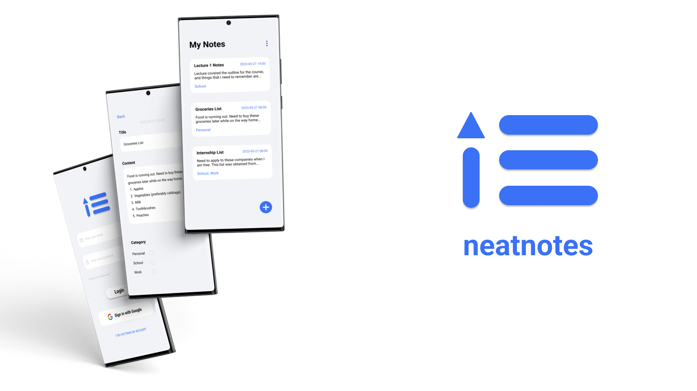

# neatnotes

neatnotes is a notes-taking Android mobile application that aims to allow users to easily create and manage their notes on the go. It has a simplistic yet functional interface, making it easy
for anyone to use.

For the front-end, it is built using Flutter. For the backend, neatnotes utilises Firebase authentication to ensure that users would not be able to see each other's notes, as well as Firestore to store notes data.

This is an application that I built when I first picked up Flutter, and it is adapted from the tutorial provided by [Vandad Nahavandipoor](https://www.youtube.com/watch?v=VPvVD8t02U8). If you are interested in learning Flutter, I would highly recommend Vandad's course, which not only provides a good introduction of Dart and Flutter, but also the intricacies of software development.

## APK Download
You can run the application on your Android device by running this APK on it.

## UI Mockup
You can view the hi-fidelity prototype for neatnotes at this [Figma link](https://www.figma.com/file/PPykJwYKVNBqVYFTJwzMPw/NeatNotes?type=design&node-id=0%3A1&t=9VcbUMcaPIIuP8sx-1).

## Demo
Insert videos here

## Core Features
1. Email and password login
2. Google account login
3. Account registration + Email verification
4. Password reset via recovery email
5. View list of notes
6. Create a new note (can enter note title, note content and select a note category)
7. Edit a note
8. Delete a note
9. Delete all notes
10. Generate the PDF version of a note
11. Logout

## Getting Started

This project is a starting point for a Flutter application.

A few resources to get you started if this is your first Flutter project:

- [Lab: Write your first Flutter app](https://docs.flutter.dev/get-started/codelab)
- [Cookbook: Useful Flutter samples](https://docs.flutter.dev/cookbook)

For help getting started with Flutter development, view the
[online documentation](https://docs.flutter.dev/), which offers tutorials,
samples, guidance on mobile development, and a full API reference.
